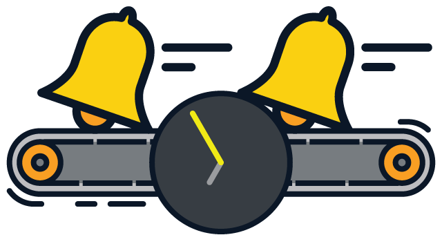
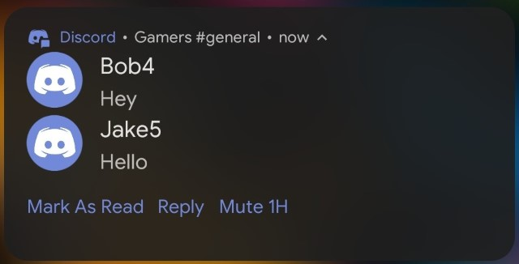
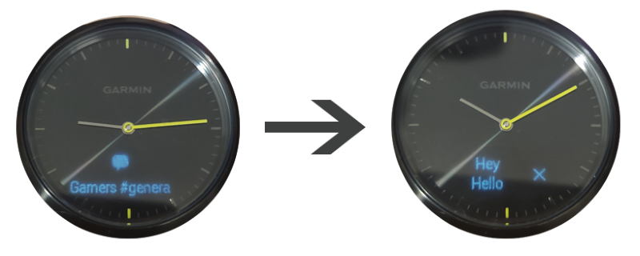
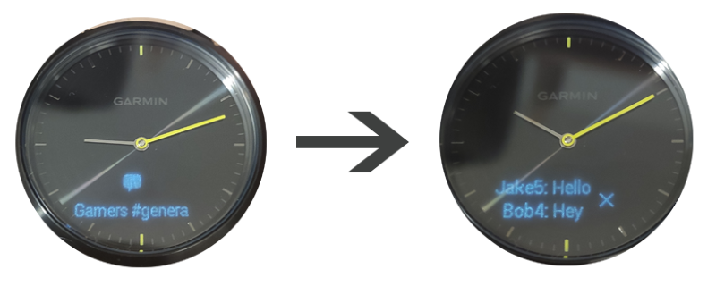
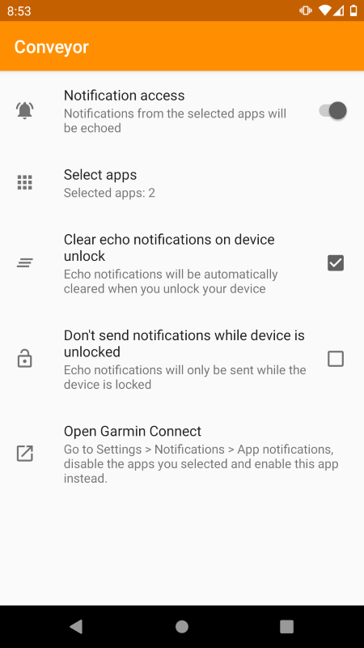

# Conveyor

Conveyor is an Android app that echoes (repeats) notifications to make them more readable for smart devices, like smart watches.

It was built with Garmin Vivomove HR in mind, but may also work with other devices.

## The issue

The Garmin Connect app copies the title and text of a notification 1:1 to the smart device. If the title is too long (which is common in chat apps, where the title is "Group name: sender"), only a partial title is displayed. That means that you can't really tell who sent the message you're reading. 

If more than one person sends a message in a group chat, it becomes difficult to distinguish between the messages, since the name of the authors is not mentioned in the notification's text.

## How Conveyor makes notifications better

By reading the notifications and resending them in a different format, Conveyor is able to send notifications that are far more readable on the smart device. It does so in 3 main ways:

1. The name of the sender is separated from the name of the group, and put in the text of the notification instead of the title.
2. If multiple people send messages in the same group, each message is prefixed with their name.
3. Messages from different senders are in reverse order, so the latest message from a group chat is always the first to be viewed.

Notifications from the app whose notifications are being reformatted and echoed should be disabled in the Garmin Connect app, so only the notification from *Conveyor* is passed to the smart device.

The app was tested with Discord, Whatsapp and Telegram, but it has been designed work with **every** Android chat app. 

## Demo

This is the notification on my phone (completely legit conversation btw):

Without conveyor, the notification on the watch will look like this:

The name of the person who sent the message should appear in the title. However, the title is too long to display it. The actual text of the notification is really not clear. 

This is the notification that Conveyor will send as an echo:

And this is how it will look like on the watch:

The names of the senders are clear, and the last message is displayed first.

## Screenshot

Some devices allow you to hide notifications from specific apps on the lock screen. That, together with the option to clear notifications when you unlock your device, makes Conveyor notifications practically invisible! 

## Download

See the [Releases page](https://github.com/SilverTuxedo/Conveyor/releases). Download the APK to your device and install it.

This app is not on the Play Store at the moment, so you may get a few warnings that I'm not a recognized publisher.
